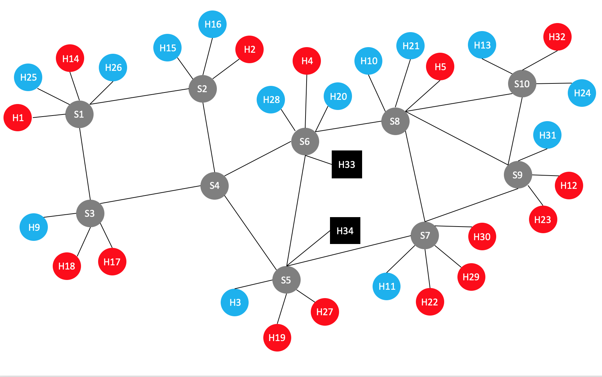
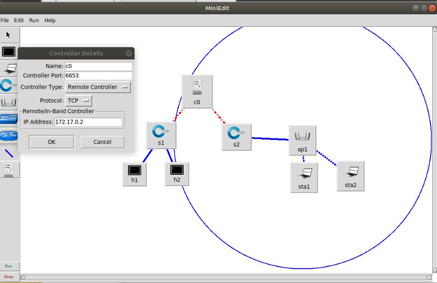

# 복잡한 Topology 데이터 수집

다음과 같은 구성으로 Network port 별 정보와 flow 정보들을 수집하기



## 차례

1. [폴더 구성](#폴더 구성)

2. [환경 설정](#환경 설정)
3. [Mininet](#Mininet)
4. [본격 수집](#본격 수집)

---

## 폴더 구성

| 폴더    | 파일               | 역할                                                         |
| ------- | ------------------ | ------------------------------------------------------------ |
| mininet | 1st_topo.py        | Mininet topology 실행                                        |
|         | ping_*.py          | mininet host에서 ping 보내기                                 |
|         | base_B_*.txt       | ping 보낼때 데이터량, 시간조건 등                            |
| onos_db | config.py          | 코드에 필요한 값들을 설정해놓는 곳<br>CTRL\_* : onos 관련 설정<br>DB\_*: influxDB 관련 설정<br>BROKER_CONF : rabbitmq 관련 설정<br>PORT_MES : task_mininet_db.py 를 통해 수행되는 Port 별 정보들을 저장할 테이블 이름<br>FLOW_MES : flow_db.py 를 통해 수행되는 flow 들을 저장할 테이블 이름 |
|         | arrange.py         | 이전에 있던 log 파일들 삭제 및 switch, host 각 명칭 수집하여 topology.json & host_mac.json 생성 |
|         | databases.py       | DB 저장, 조회와 파일 생성, 조회 함수                         |
|         | celeryconfig_db.py | Celery 실행시 필요한 값들 저장 (arrange.py 에 main 함수가 자동으로 실행되어 정보를 불러옴) |
|         | task_mininet_db.py | Celery 에서 실질적으로 실행되는 함수, port 별 데이터를 수집 및 값 계산 |
|         | flow_db.py         | flow 테이블을 수집 및 저장하는 함수                          |


## 환경 설정

* docker, influxdb, mininet 초기화

  1. rabbitmq 실행 (celery broker)

  ```sh
  $ sudo docker run -d --name rabbitmq -p 5672:5672 -p 8080:15672 --memory 2048m --rm --hostname my-rabbit -e RABBITMQ_DEFAULT_USER=sdn -e RABBITMQ_DEFAULT_PASS=sdn -e RABBITMQ_VM_MEMORY_HIGH_WATERMAR=40% rabbitmq:management
  ```

  2. onos 실행

  ```sh
  $ sudo docker run --rm -t -d -p 8181:8181 -p 8101:8101 -p 6653:6653 --name onos1 onosproject/onos:2.2.2
  ```

  3. mininet 초기화

  ```sh
  $ sudo mn -c
  ```

* config.py 에서 변경사항 있으면 변경 (특히, PORT_MES 와 FLOW_MES)

  1. rabbitmq와 onos의 ip 주소 조회

  ```sh
  $ sudo docker inspect rabbitmq | grep IPAddress
  	"IPAddress": "172.17.0.2",
  $ sudo docker inspect onos1 | grep IPAddress
  	"IPAddress": "172.17.0.3",
  ```

  2. config.py 파일 수정 부분 확인 및 수정
     * bro_ip           에 아까 확인했던 rabbitmq IPAddress 넣기
     
     * CTRL_IP        변수에 이전에 확인한 onos1 IPAddress 넣기
     
   * PORT_MES   변수에 port 별 데이터를 넣을 테이블 이름 넣기
     
   * FLOW_MES  변수에 flow 데이터를 넣을 테이블 이름 넣기
     
       
  
  * PORT_MES 와 FLOW_MES에 넣은 테이블 이름과 같은 테이블이 이미 influxDB에 존재하는 경우? influxDB cli 창에 들어가서 해당 테이블 지우기
  
```sh
  $ influx
  >> use {{database 이름}}
  >> drop measurement {{지우고 싶은 table 이름}}
```

​    

## Mininet 

* 원하는 Topology 는 miniedit 으로 생성하기

  ```sh
  # mininet-wifi 설치 폴더에서
  # examples 폴더로 가서 miniedit.py 실행
  $ cd /mininet-wifi/examples
  $ sudo python2 miniedit.py
  ```

  * 위 명령어를 실행하면 MiniEdit 창이 나온다.왼쪽에, controller, swith, host 등의 아이콘들을 클릭하여 배치하면서 원하는 토폴로지를 생성한다.생성 후, 배치한 controller 를 오른쪽 마우스로 클릭 후, Controller Port 를 6653, Controller Type 을 Remote Controller로 바꾸고, IP Address 를 현재 운영중인 onos 의 ip 를 입력 한 후에 ok 클릭

     
     
  * 위에, Edit 의 preferences 클릭, Start CLI 에 체크 표시

  * File 에 Export Level 2 Script 클릭 하여 생성한 토폴로지를 원하는 위치에 python 파일로 저장

  * 생성한 파일의 위치를 찾아가 파일의 이름을 이용하여 Mininet 실행 (ex) 파일이름이 1st_topo.py 일 때,

     ```sh
     $ sudo python2 1st_topo.py
     ```

     

* pingall 실행 (이걸 하지 않으면 host 들이 인식이 안되어서 문제가 있음)

     ```cmd
     mininet-wifi> pingall
     ```


* xterm 이용해서 host 들의 개별 창을 켜놓고 ping 명령어 **준비**해놓기 (ex) ping_s1.py 이용

  ```cmd
  mininet-wifi> xterm h1 h2 h3
  ```
  
  

## 본격 수집

* task_mininet_db.py 를 실행하면, celeryconfig_db.py 가 자동으로 불리고 그 파일 속에서 arrange.py 에 있는 main() 함수가 자동으로 실행 

  * main() 함수는 기존에 있던 /log/*.log 파일들을 모두 지우고, host 들의 mac 주소가 담긴 host_mac.json 파일과 switch 들의 명칭과 port 별 host 들의 명칭이 담긴 topology.json 파일을 만들어낸다.

  > 명칭 기본 규칙
  >
  > onos 에서 지어진 이름들의 뒷 16진수 숫자를 10진수로 바꿔서 붙인다.
  >
  > 예 ) onos 에서 switch 이름이 "of:000000000000000a" 일 때 = "S10"
  >
  > 예 ) onos 에서 host 이름이 "10.0.0.3" 일 때 = "H3"

* task_mininet_db.py (celery)와 flow_db.py 를 각기 다른 터미널에서 동시 실행

  * task_mininet_db.py

  ```sh
  $ sudo celery -A task_mininet_db worker -B --loglevel=info
  ```

  * flow_db.py

  ```sh
  $ sudo python3 flow_db.py
  ```

* Mininet 에서 xterm 을 불러와 준비해놓은 명령어 모두 실행시키기

* 명령들이 종료될 때 까지 프로그램 실행해놓기

* 종료 후, influxDB 에서 데이터들 csv 파일로 추출

  ```sh
  # influx --precision rfc3339 -database '[database 이름]' -execute 'select * from "[measurement 이름]"' -format csv > [원하는 파일 이름].csv
  $ sudo influx --precision rfc3339 -database 'sdn' -execute 'select * from "test"' -format csv > result_ping.csv
  # time 항목 값들을 timestamp 형식으로 뽑아 내고 싶은 경우 --precision rfc3339 를 지우고 실행
  $ sudo influx -database 'sdn' -execute 'select * from "test"' -format csv > result_ping.csv
  ```

  

